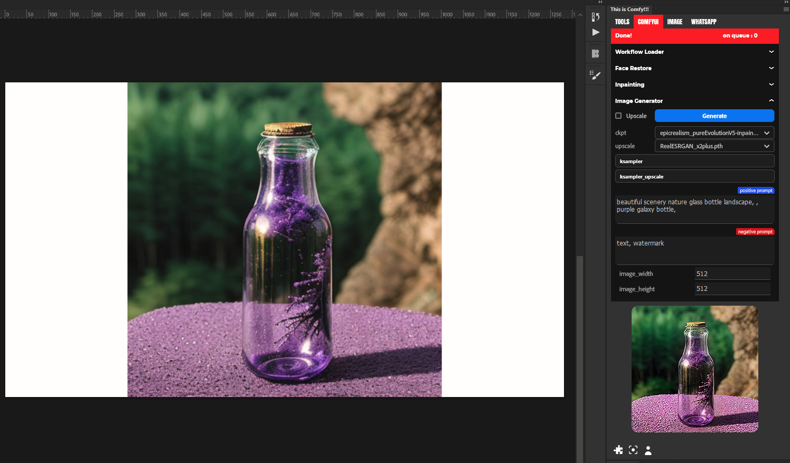

# ComfyUI plugin for Photoshop (24.4)

- Must run ComfyUI server first.
- on the first run, it will ask u where u put ur comfyui folder (needed this for input and output folder).
- after that it will ask for workflow folder (u can make any folder anywhere. and store your workflow there for future use).

## Workflow Loader

store all your workflow.json (the one that generate with Save(API Format) on ComfyUI) in a folder

## Face Restore

must have custom node to make it work

## Inpainting

todo

## Image Generator

Simple workflow for generating Image
